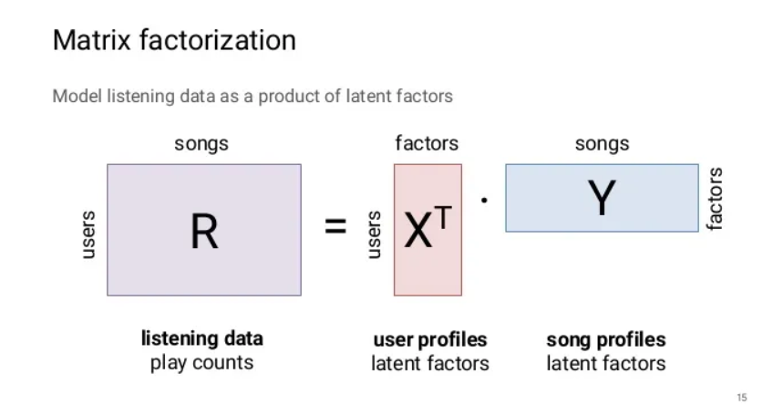

# 大数据原理与技术第七次实验
学号:20337011   姓名:陈俊皓

## 实验要求
+ 实现`Latent factor model`和`Collaborative model`
+ 找公开的`MovieLens`任何一个数据集(<a href="https://grouplens.org/datasets/movielens/">https://grouplens.org/datasets/movielens/</a>)进行测试(随机划分80%训练，20%测试),独臂两个算法的RMSE
+ 写一个实验报告

## 实验过程

### 数据集处理
在此次实验中，选取了`ml-1m`数据集。其中包含三个数据文件`movies.dat`,`users.dat`,`ratings.dat`,其中分别存储了电影编号与电影名称的映射关系及其相应的特征信息(电影类型)，用户编号与其用户名称的映射关系及其相应的特征信息(性别，年龄等)，不同用户对于不同电影的评分记录。三个文件不同数据域之间的间隔均为`::`。

因此，我们选取`pandas`库读取文件并完成训练集与测试集的划分任务。具体操作如下:

1. 利用`read_csv`读取相应文件并为数据域进行命名:
```python
users=pd.read_csv('./ml-1m/users.dat',delimiter="::",header=None)
items=pd.read_csv('./ml-1m/movies.dat',delimiter="::",header=None,encoding='latin-1')


ratings=pd.read_csv('./ml-1m/ratings.dat',delimiter="::",header=None)
ratings.columns=['userId','movieId','rating','timestamp']
```

2. 去除无用的数据特征:
```python
ratings=ratings.drop(['timestamp'],axis=1)
```

3. 划分训练集与测试集，并获取构建模型所需的参数:
```python
train_data=ratings.sample(frac=0.8,random_state=1)
test_data=ratings.drop(train_data.index)

user_count=users.iloc[:,0].max(skipna=False)
item_count=items.iloc[:,0].max(skipna=False)
```

## 协同滤波(collaborative filtering)实现

在使用协同滤波实现推荐系统的时候，由于需要计算`item-item`或`user-user`的相似性，因此首先需要将`Dataframe`形式的数据转化为矩阵的形式:
```python
train_matrix = train_data.pivot_table(index='userId', columns='movieId', values='rating').fillna(0)
```

随后，我们即可计算不同用户的相似性:
```python
from sklearn.metrics.pairwise import cosine_similarity

user_similarity=cosine_similarity(train_matrix)
```

在得到了用户之间的相似性矩阵之后，我们即可在判断某一用户对于某一部电影的评分时，利用与其相似用户对该电影的评分信息，对评分进行估计。

```python
def predict_user_based(user_similarity,train_matrix,user,item,k=10):
    # find k-nearnest
    similar_users=np.argsort(user_similarity[user])[::-1][1:k+1]
    # compute weight
    weights=user_similarity[user][similar_users]
    # find the score
    try:
        ratings=train_matrix.loc[similar_users+1, item]
        # compute predict score
        return np.dot(weights, ratings) / weights.sum()
    # if empty
    except:
        return train_matrix.loc[user].mean()
```

最后，我们在测试集上进行测试，并计算最后的损失:
```python
predictions = []
for i, row in tqdm(test_data.iterrows(), total=len(test_data)):
    user = row['userId']-1
    item = row['movieId']
    rating = row['rating']
    pred = predict_user_based(user_similarity, train_matrix, user, item)
    predictions.append(pred)
rmse = np.sqrt(np.mean((np.array(predictions) - test_data['rating']) ** 2))
mae = np.mean(np.abs(np.array(predictions) - test_data['rating']))
print('RMSE:', rmse)
print('MAE:', mae)
```

### `Latent-factor-model`实现
`Latent-factor-model`利用引入隐变量的方法，增强模型的表达能力。在推荐系统的应用中，我们利用矩阵分解的思想实现该算法。首先，我们建立用户特征矩阵,其大小为$users \cdot factors$,$factors$人为指定，该矩阵表明用户可能存在的特征信息。而后，我们建立电影特征矩阵，与用户特征矩阵类似，其表明电影可能存在的特征。随后，我们可以用矩阵乘法的方式将其转换为原来`ratings`矩阵的形式，利用梯度下降的方式我们可以更新相应的参数，从而得到更准确的表达。其作用方法如下图所示:


根据其实现思路，我们可以建立隐变量模型如下:
```python
class LatentFactorModel:
    def __init__(self,n_users,n_items,n_factors,lr=0.01,reg=0.1,n_epochs=10):
        self.n_users=n_users
        self.n_items=n_items
        self.n_facotrs=n_factors
        self.lr=lr
        self.reg=reg
        self.n_epochs=n_epochs

        # initial
        self.user_factors=np.random.normal(scale=1.0/n_factors,size=(n_users,n_factors))
        self.item_factors=np.random.normal(scale=1.0/n_factors,size=(n_items,n_factors))

        # print(self.user_factors.shape,self.item_factors.shape)

    def fit(self,X:pd.DataFrame):
        for epoch in range(self.n_epochs):
            # suffle
            XShuffle = X.sample(frac=1).reset_index(drop=True)
            # update
            for i,row in tqdm(XShuffle.iterrows(),total=len(XShuffle)):
                user=row['userId']-1
                item=row['movieId']-1
                rating=row['rating']


                pred=np.dot(self.user_factors[user],self.item_factors[item])

                error=rating-pred

                self.user_factors[user]+=self.lr*(error*self.item_factors[item]-self.reg*self.user_factors[user])
                self.item_factors[item] += self.lr * (error * self.user_factors[user] - self.reg * self.item_factors[item])
            
    def predict(self,X:pd.DataFrame):
        preds=[]
        for i,row in tqdm(X.iterrows(),total=len(X)):
            user=row['userId']-1
            item=row['movieId']-1

            pred = np.dot(self.user_factors[user], self.item_factors[item])
            preds.append(pred)
        
        return np.array(preds)
    
    def evaluate(self,X):
        preds=self.predict(X)
        mse=np.mean((X['rating']-preds)**2)
        rmse=np.sqrt(mse)

        return rmse
```


## 实验结果
在协同滤波模型中，rmse为`2.5248`
在隐变量模型中，rmse为`0.9070`


## 实验心得
通过此次实验，我了解到了推荐系统的算法实现。
