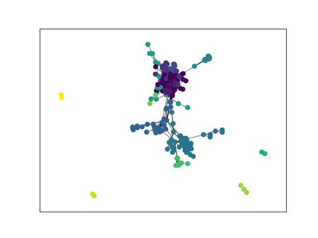

# 大数据原理与技术第八次实验

学号:20337011 姓名:陈俊皓

## 实验要求
+ 下载并运行`GenLouvain`算法
+ 从`SNAP`网站下载相应的数据集，测试`GenLouvain`算法结果

+ 通过NMI指标评估算法结果

+ 通过modularity指标评估算法结果

+ 通过实验结果分析NMI和modularity两个指标之间的关系

## 实验过程

### `Modularity`指标

模块化指标表示为:
$$
    Q=\frac{1}{2m}\sum_{ij}[A_{ij}-\frac{k_ik_j}{2m}]\delta(c_i,c_j)
$$

其中:

+ $A_{ij}$表示节点$i$和节点$j$有向边的权重。
+ $k_i$和$k_j$是对于$i$和$j$的边权重和。
+ $m$是有向图中所有边的权重之和。
+ $c_i$和$c_j$是节点$i$和$j$所属于的社区。
+ $\delta$是Kronecker delta function($\delta(x,y)=1\;if\;x=y,0\; otherwise $)

我们可以把上式转换为:

$$
Q_c=\frac{\sum_{in}}{2m}-(\frac{\sum_{tot}}{2m})^2
$$

其中:
+ $\sum_{in}$表示一个社区内的边权重之和，此处一条边计算两次。

+ $\sum_{in}$表示全图的边权重之和，此处一条边计算两次。


### `GenLouvain`算法

`GenLouvain`算法的优化目标就是上述函数。基本的思想是不断尝试合并相邻的节点(使用图论中节点坍缩的方法)，随后计算$\Delta Q$，如果该值为正，则保留该合并;否则,放弃该合并。

$\Delta Q$的计算方式如下:
$$
\Delta Q=[\frac{\sum_{in}+2k_i,in}{2m}-(\frac{\sum_{tot}+k_i}{2m})^2]-[\frac{\sum_{in}}{2m}-(\frac{\sum_{tot}}{2m})^2-(\frac{k_i}{2m})^2]
$$


此处的$k_{i,in}$表示节点$i$与社区内其他节点连接权重之和。


### 数据集
此次选用`snap/community/facebook`数据集，包含`circles`(社区分类)，`edges`(边集)等文件。

`circles`
```C
circle0	71	215	54	61	298	229	81	253	193	97	264	29	132	110	163	259	183	334	245	222
circle1	173
circle2	155	99	327	140	116	147	144	150	270
circle3	51	83	237
circle4	125	344	295	257	55	122	223	59	268	280	84	156	258	236	250	239	69
circle5	23
circle6	337	289	93	17	111	52	137	343	192	35	326	310	214	32	115	321	209	312	41	20
circle7	225	46
circle8	282
circle9	336	204	74	206	292	146	154	164	279	73
circle10	42	14	216	2
circle11	324	265	54	161	298	76	165	199	203	13	66	113	97	252	313	238	158	240	331	332	134	218	118	235	311	151	308	212	70	211
circle12	278
circle13	138	131	68	143	86
...
```

`edges`文件
```C
236 186
122 285
24 346
271 304
176 9
130 329
204 213
252 332
82 65
276 26
280 272
...
```

### 实现代码
```python
from community import community_louvain
from dataset import dataset,real_label
import community

import matplotlib.cm as cm
import matplotlib.pyplot as plt
import networkx as nx


# Load the Facebook network
G = nx.read_edgelist("facebook/0.edges")

# Compute the community partition using the Louvain algorithm
partition = community.best_partition(G)
modularity = community.modularity(partition, G)

# modularity
print(f"modularity: {modularity:05f}")

# NMI
from sklearn.metrics.cluster import normalized_mutual_info_score

# Convert the ground truth communities and the Louvain communities to lists
circles=real_label()
cur_len=len(circles)

true_labels = []
louvain_labels = []
for node_id, community_id in partition.items():
    louvain_labels.append(community_id)
    flag=0
    for circle_name, node_ids in circles.items():
        if node_id in node_ids:
            true_labels.append(circle_name)
            flag=1
            break
    
    if flag==0:
        true_labels.append(cur_len)
        cur_len+=1


# Compute the NMI between the ground truth communities and the Louvain communities
nmi = normalized_mutual_info_score(true_labels, louvain_labels)
print(f"NMI:{nmi:03f}")

import pandas as pd
pd.DataFrame({'Id':partition.keys(),'Group':partition.values()})


# draw the graph
pos = nx.spring_layout(G)

# color the nodes according to their partition
cmap = cm.get_cmap('viridis', max(partition.values()) + 1)
nx.draw_networkx_nodes(G, 
                       pos, 
                       partition.keys(), 
                       node_size=40,
                       cmap=cmap, 
                       node_color=list(partition.values())
                      )
nx.draw_networkx_edges(G, pos, alpha=0.5)

plt.savefig('community.png')
```

## 实验结果
`modularity`与`NMI`指标的实际结果如下:
```C
modularity: 0.448994
NMI:0.436777
```

从实验结果可以看到，二者的实际数值较为接近。

可视化效果下


## 实验心得
通过此次实验，我了解到了`modularity`的计算方式以及`louvain`算法的实现过程。
